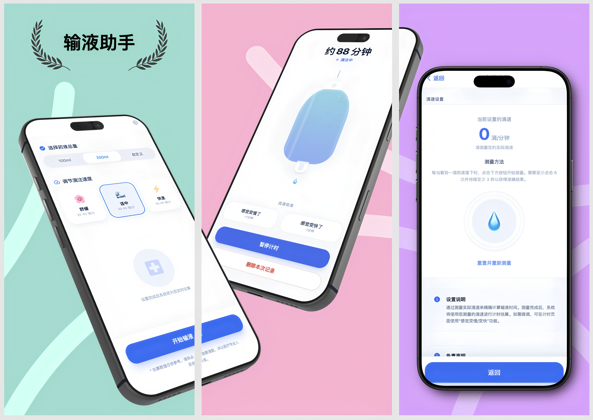

# Infusion Timer - 你的输液好帮手

嘿！还在为输液时间而苦恼吗？🤔 别担心，**Infusion Timer** 来啦！这是一个专为医疗场景设计的智能输液计时器，让输液过程变得轻松有趣。

## 💝 为什么选择我们？

输液的时候，你最怕什么？⏰

- 怕不知道还剩多久，焦虑不安 😟
- 怕错过护士换瓶的时间，耽误治疗 😰
- 怕一个人孤零零地等着，无聊又无助 😔

别担心，我们就是来陪伴你的！

- **❤️ 贴心陪伴** - 实时显示剩余时间，让你安心休息
- **📱 随时可用** - H5网页版+小程序版，扫扫二维码就能用
- **🌙 温柔界面** - 舒适的配色设计，护眼又温暖
- **🔒 安全放心** - 数据只存在你手机里，隐私完全保护
- **🎯 超级简单** - 几下就能设置好，傻瓜式操作

## 🚀 快速开始

**方法一：H5网页版**
直接在浏览器中打开使用

**方法二：小程序版**
微信扫码进入小程序

操作超级简单：
1. **选择参数** - 输液量、滴速，几下就选好
2. **开始计时** - 躺下来休息吧
3. **等待提醒** - 到时间我们会温柔提醒你

（二维码图片稍后补上哦～）

## 🛠️ 技术栈

- **前端框架**: Preact + TypeScript
- **样式**: Tailwind CSS
- **状态管理**: Zustand
- **构建工具**: Vite
- **PWA**: vite-plugin-pwa
- **测试**: Vitest + Testing Library

## 📱 支持平台

- **🌐 H5网页版** - 所有现代浏览器都能用
- **💬 微信小程序** - 微信扫码就能进

手机平板完美适配，躺着输液也能轻松操作！

---

**Infusion Timer** - 让输液时光温暖又安心！💉✨

*有想法或建议？随时找我们聊聊呀！*